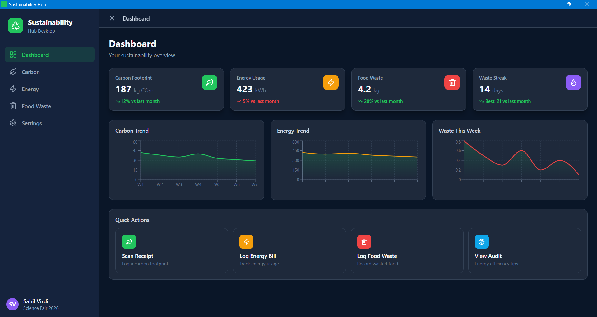

# Sustainability Hub

AI powered garbage/waste analyzer with some personal sustainibility dashboards around it.
Made for Indian Science Congress 2026.

Main idea: take a pic of any garbage (or point webcam at it) and the AI tells you what
materials are in it and how much persent of each, how harmful it is + which toxins,
what its used for, eco friendly alternatives, reuse ideas, and where u can actually
give it for recycling/disposal.



## Daily Logs

science congress needs daily proof of work — everything i do each day goes in the
[logs/](./logs/) folder as `YYYY-MM-DD.md` and gets commited and pushed here.

## Tech Stack

| Layer | Technology |
|-------|-----------|
| **Mobile** | React Native + Expo Router, TypeScript, Zustand |
| **Desktop** | Tauri v2 + Vite + React + TypeScript + Tailwind CSS |
| **Backend** | FastAPI + SQLAlchemy + PostgreSQL |

## Features

- **AI Waste Analyzer** (main feature) — capture/upload garbage photo → material percentages, toxins + harmfulness score, uses, alternatives, where to dispose it. Uses Gemini vision API (OpenAI also supported)
- **Carbon Tracker** — scan receipts or manually log purchases to calculate kg CO₂e per item
- **Energy Monitor** — parse utility bills, track kWh/gas/water usage, run home energy audits
- **Food Waste Logger** — photo analysis of plate waste, daily streaks, waste breakdowns
- **Dashboard** — charts, stat cards, suggestions, badges
- **Settings** — profile, household settings, notifications

## AI Setup (needed for the waste analyzer)

```bash
cd backend
copy .env.example .env   # then paste ur key into GEMINI_API_KEY
```

free gemini key: https://aistudio.google.com/apikey (or use OPENAI_API_KEY with
AI_PROVIDER=openai in the same file)

## Getting Started

### Mobile (Expo)

```bash
cd mobile
npm install
npx expo start --clear
```

Scan the QR code with Expo Go on your phone.

### Desktop (Tauri)

```bash
cd desktop
npm install
npm run dev       # Vite dev server only
npx tauri dev     # Full Tauri window (requires Rust)
```

### Backend (FastAPI)

```bash
cd backend
pip install -r requirements.txt
uvicorn app.main:app --reload
```

> **Note:** Backend requires Python 3.12+, PostgreSQL, and native dependencies (pydantic-core).

## Project Structure

```
sustainability/
├── mobile/              # React Native Expo app
│   ├── app/             # Expo Router screens
│   ├── src/
│   │   ├── screens/     # Screen components
│   │   ├── components/  # Shared components
│   │   ├── hooks/       # Custom hooks (useCarbon, useEnergy, etc.)
│   │   ├── store/       # Zustand stores
│   │   ├── ui/          # UI primitives (Button, Card, Badge, etc.)
│   │   └── utils/       # Formatters, helpers
│   └── constants/       # Theme, config
├── desktop/             # Tauri desktop app
│   ├── src/
│   │   ├── pages/       # Dashboard, Carbon, Energy, FoodWaste, Settings
│   │   ├── lib/         # API client
│   │   └── types/       # TypeScript interfaces
│   └── src-tauri/       # Rust backend (Tauri)
├── backend/             # FastAPI server
│   ├── app/
│   │   ├── api/         # API v1 endpoints
│   │   ├── models/      # SQLAlchemy models
│   │   └── schemas/     # Pydantic schemas
│   └── requirements.txt
└── shared/              # Shared TypeScript types
```

## Three Pillars

### 1. Carbon Footprint
Track the environmental impact of every purchase. Scan a receipt or enter items manually — each product is categorized and assigned a CO₂e estimate.

### 2. Home Energy
Upload utility bills to extract electricity (kWh), gas (therms), and water (gallons) data. Run an energy audit to get personalized efficiency recommendations with estimated savings.

### 3. Food Waste
Log meals to track what gets wasted and why. Build zero-waste streaks, see waste broken down by category (plate waste, spoilage, preparation), and get tips to reduce waste.

## License

Science Fair 2026 — Sahil Virdi
